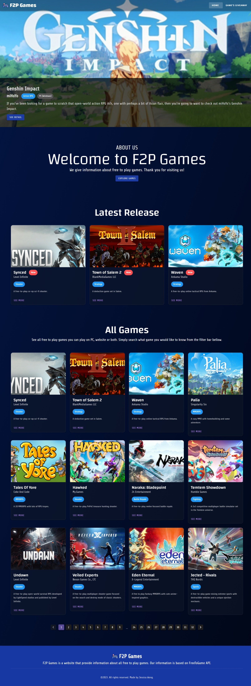
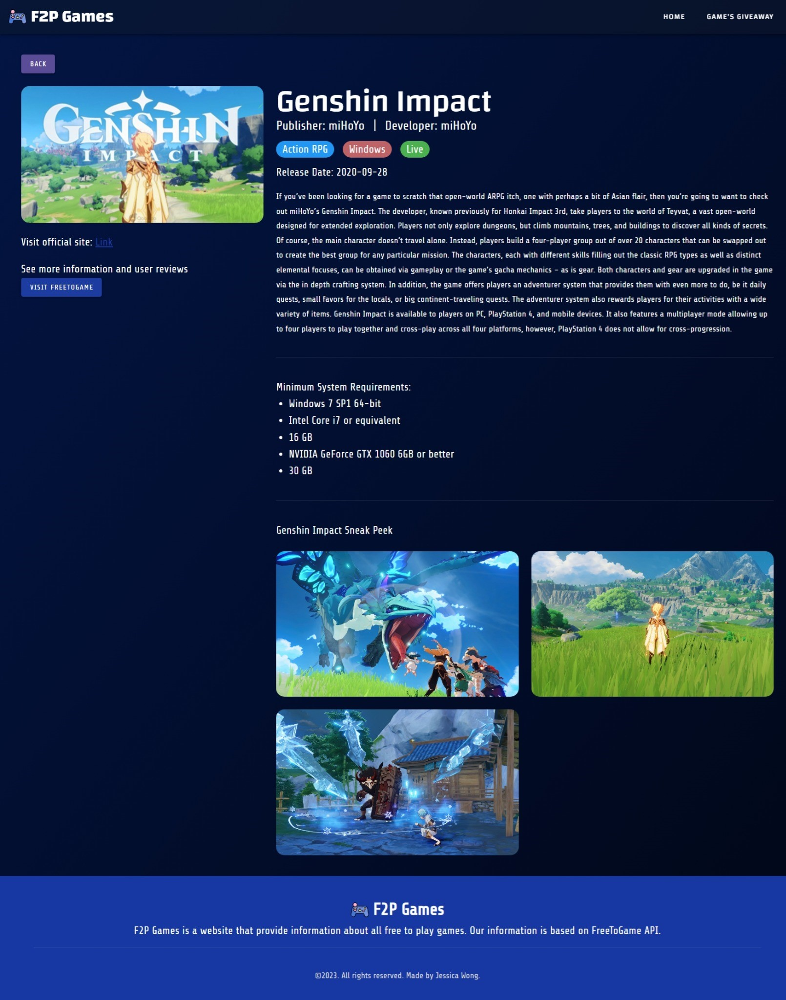

# Vue Alterra - Prakerja Uji Keterampilan

## Description

This project is a final project or uji keterampilan for prakerja training - Vue by alterra.

F2P Games is a website that provides information about all the free to play games that fetch from FreeToGame API.

### Home page

In this home page there's a carousel to show top 5 popular game and then there's latest release game and all games.

### Game detail page

Game detail consist of the detail of the game as example below it's a detail of Genshin Impact

### How to run

1. git clone https://github.com/iam-jessicawong/jessica-wong-vue-pk.git
2. `yarn install`
3. `yarn serve`
4. Open on `http://localhost:8080/` or any local link that provides after compilation success

### Package use

- axios: ^1.5.0
- core-js: ^3.8.3
- vue: ^2.6.14
- vue-router: ^3.5.1
- vuetify: ^2.6.0
- vuex: ^3.6.2
- vuex-persistedstate: ^4.1.0

### Deployment
